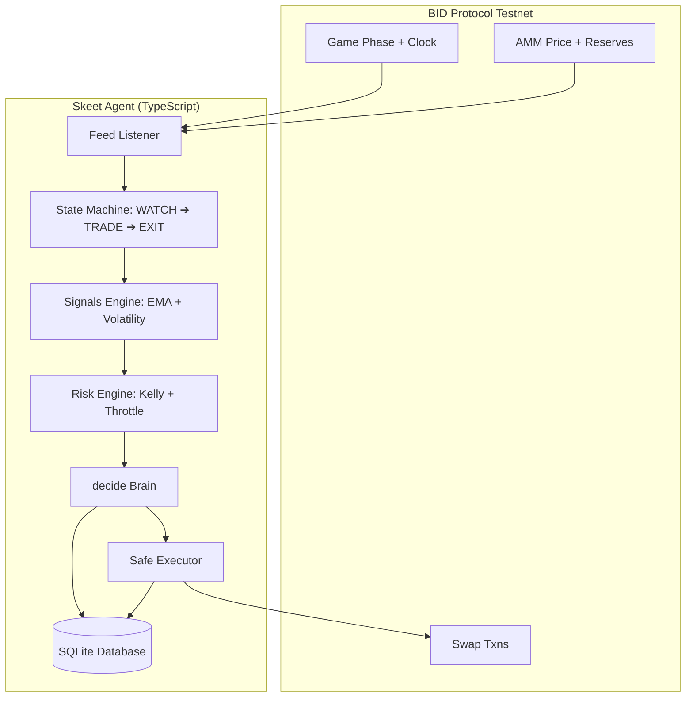

# 🎯 Skeet — PVP Trading Agent

Skeet is a fully autonomous trading agent built specifically for Creatorbid's **BID Protocol "Beat the House"** PvP trading competition.

## 🎬 Architecture & Loop

Skeet shoots clay-pigeon tokens as they launch and walks away before the pool dissolves. Each game runs three phases: Lobby -> Market Making (30s) -> Trading (180s).



---

## ⚡ Why BID Protocol? (Protocol-Native Edge)

Skeet's strategies are built entirely on BID Protocol's native infrastructure:
1. **Clock Synchronization:** `GET /api/game` exposes exact server timelines. Skeet uses this to synchronize WATCH and EXIT states.
2. **Dissolution payoff structure:** Skeet front-runs the 180s dissolution window at second `162s` to bypass the high slippage of the AMM pool liquidation.
3. **Budget Guards:** Sizing fractions are calculated natively against the EOA/Safe balances on chain `42069`.

---

## 🚀 Performance Benchmarks & Testing

### 1. Test Suite Results
* **Vitest Suite**: **119 unit tests passing**
* **Coverage**: **>95% statement coverage** on core files (`src/decide.ts`, `src/risk.ts`, `src/signals.ts`, `predator/predator.ts`).

### 2. Latency Benchmarks
Running `npm run bench` over 1,000 mock tick evaluations returns the following performance profiles:

| Metric | Latency |
|---|---|
| **Min** | 0.0003 ms |
| **Max** | 0.0636 ms |
| **Mean** | 0.0006 ms |
| **p50 (Median)** | 0.0005 ms |
| **p95** | 0.0011 ms |

---

## 🛠️ Local Repro & Execution

### 1. Setup
Copy `.env.example` to `.env` and fill in your BID access code:
```bash
cp .env.example .env
```

Install parent and subproject dependencies:
```bash
npm install
cd dashboard && npm install && cd ..
```

### 2. Run Tests & Safety Scripts
Verify math and safety constraints:
```bash
# Run unit tests
npm test

# Run offline safety verification
npm run verify-offline

# Run backtest comparison
npm run backtest
```

### 3. Start the Daemon
Register the agent and run the live trading loop:
```bash
npm start
```

### 4. Telemetry Dashboard
Launch the dashboard UI to monitor real-time PnL and active round execution charts:
```bash
cd dashboard
npm run dev
# Open http://localhost:3000
```
