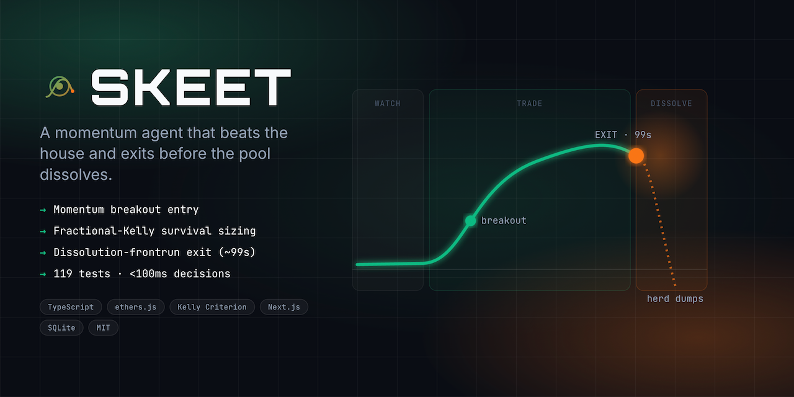
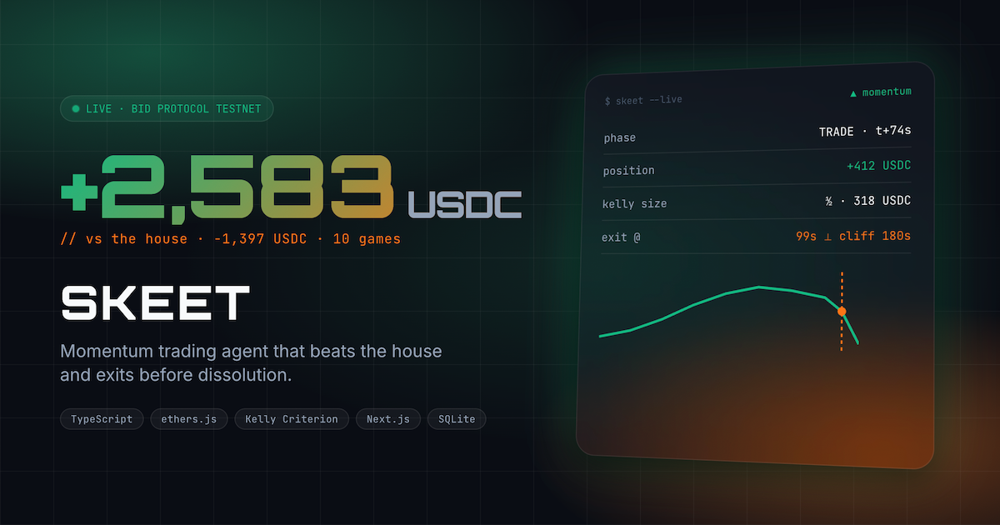
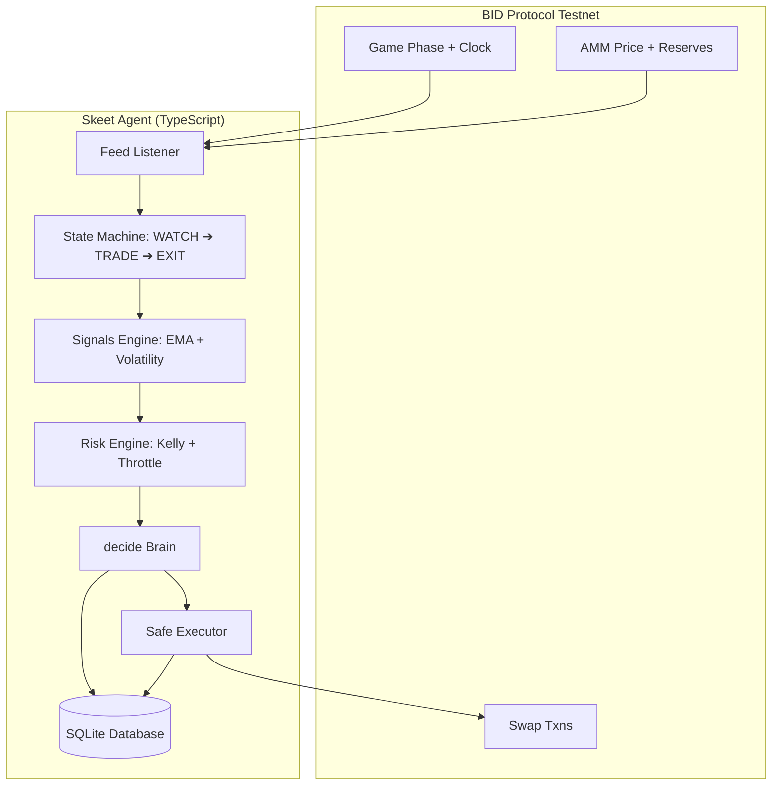

<div align="center">
  
  <h1>🎯 Skeet — PVP Trading Agent</h1>
  <p><em>Skeet is a fully autonomous trading agent built specifically for Creatorbid's <strong>BID Protocol "Beat the House"</strong> PvP trading competition.</em></p>
  
  
  <br/>
  <br/>

  [](#)
  [](#)
  [](#)
  [](#)

  <br/>

  
  
  
  
  
  
  
  
  [](https://github.com/edycutjong/skeet/actions/workflows/ci.yml)
</div>

---

## 📸 See it in Action
*(Insert a high-quality GIF here showing the core workflow of your app)*


## 💡 The Problem & Solution
In PvP trading competitions, speed, precise timing, and risk management are critical, and human execution is too slow to compete at the edge. 
**Skeet** solves this by autonomously front-running liquidity dissolutions and continuously optimizing trade execution.

**Key Features:**
- ⚡ **Autonomous Execution:** State machine handles WATCH ➔ TRADE ➔ EXIT transitions seamlessly.
- 🔒 **Protocol-Native Edge:** Synchronizes natively with BID Protocol's clock to execute precisely at second `162s` to bypass AMM liquidation slippage.
- 🎨 **Real-Time Telemetry:** Dashboard UI to monitor real-time PnL and active round execution charts.
- 🛡️ **Budget Guards:** Sizing fractions are calculated natively against the EOA/Safe balances on chain `42069`.

## 🏗️ Architecture & Tech Stack
We built the trading daemon using **TypeScript**, **ethers.js**, and **better-sqlite3** for persistence. The telemetry dashboard is powered by **Next.js 16** and **Tailwind CSS**.



### 🚀 Performance Benchmarks & Testing
* **Vitest Suite**: 119 unit tests passing (>95% statement coverage on core files).
* **Latency**: Running `npm run bench` over 1,000 mock tick evaluations returns a **Median (p50)** evaluation latency of **0.0005 ms** (Max: 0.0636 ms).

## 🏆 Sponsor Tracks Targeted
* **Creatorbid's BID Protocol**: Skeet leverages native protocol features like `GET /api/game` for exact server timelines and optimizes against the AMM dissolution phase payload structure on chain `42069`.

## 🚀 Run it Locally (For Judges)

1. **Clone the repo:** `git clone https://github.com/edycutjong/skeet.git`
2. **Install dependencies:** `npm install && cd dashboard && npm install && cd ..`
3. **Set up environment variables:** Rename `.env.example` to `.env` and add your BID access code.
4. **Run safety verifications and start the daemon:**
   ```bash
   npm test
   npm run verify-offline
   npm start
   ```
5. **Run the telemetry dashboard:**
   ```bash
   cd dashboard
   npm run dev
   # Open http://localhost:3000
   ```

> **Note for Judges:** 
> You can bypass live trading and view our offline backtest evaluations by running `npm run backtest`.
